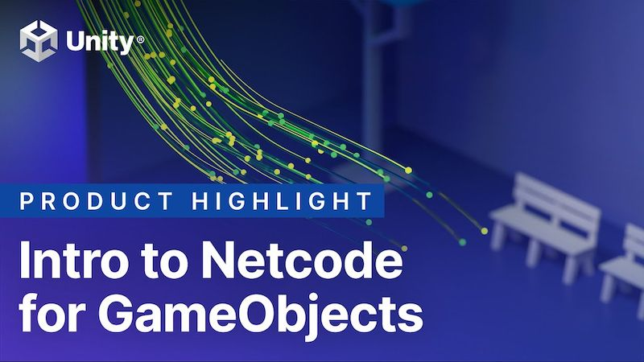

# TIC TAC TOE-GETHER

  

## DESCRIPTION

This is a multiplayer tic tac toe game that's built with Unity's [__Netcode for GameObjects__](https://unity.com/products/netcode), which follows [__Code Monkey's Simple Multiplayer Course__](https://www.youtube.com/watch?v=YmUnXsOp_t0&t=27s).

## TOOLS:

- Unity 6 (6000.0.58f2)
- Visual Studio Code

## LINKS

Check out the premium version of this course [__here__](https://unitycodemonkey.teachable.com/p/learn-how-to-make-the-simplest-multiplayer-game?coupon_code=MP_COURSE&product_id=6032677).